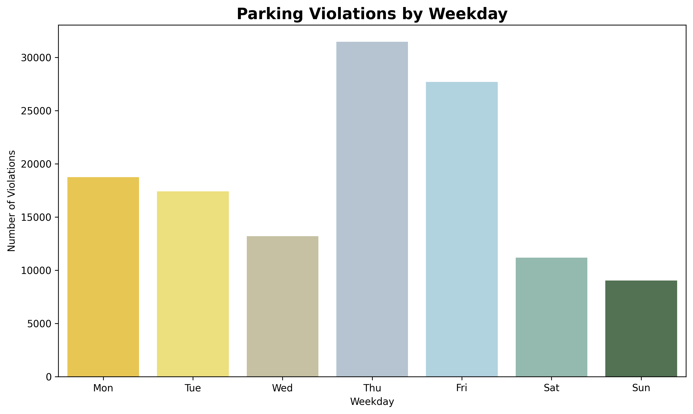
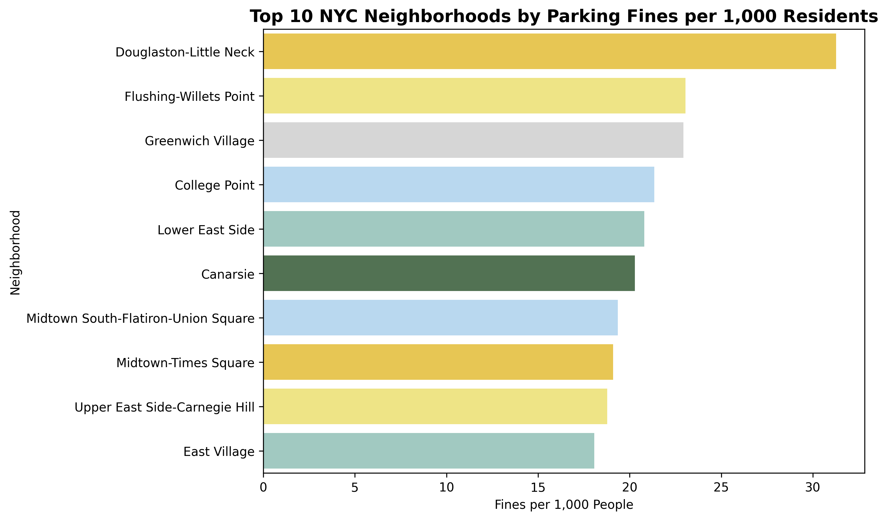

# 🧭 Welcome — Let’s Talk Fines

_Getting fines in NYC sucks - but it happens a lot. Ever wondered when and where you're most likely to get one? We looked at thousands of real violations to figure out the patterns behind the fines.
This site breaks down when fines are handed out, where they happen most, and what types of cars get hit the hardest — with interactive maps and charts you can explore yourself._

---

## 🕒 When Do People Get Fined?

Turns out, time really matters. Most tickets aren’t random — they spike around weekday mornings, especially during street cleaning hours. You’re a lot safer overnight.
Below, you can explore when fines peak during the day and how it varies.

  <iframe src="/assets/violation_by_hour.html" width="100%" height="600" style="border:none;" ></iframe>
  <iframe src="/assets/fines_by_hour_and_borough.html" width="100%" height="600" style="border:none;" ></iframe>

### So, When Are Fines at Their Worst?

It’s pretty clear from the graphs above: **weekday mornings** — especially between **8 AM and 10 AM** — are when fines are at their peak. Why? **Street cleaning!** This is the time when most of the parking violations happen, and it’s not surprising. We’re all busy in the morning, rushing to get to work, and sometimes we overlook those annoying street cleaning signs.

If you’re the type who likes to comute to work by car, **double-check the signs** before leaving your car. The fines come quick when street cleaning is in full swing!

### But What About Overnight?

If you’re hoping for a safer bet, here’s a little tip: **you’re a lot safer at night**. As the night settles in, fines drop significantly. This makes sense — fewer people are out and about, and street cleaning usually slows down after late hours. So, if you’re planning to park overnight, you're likely in the clear, especially if it's after **10 PM**.

### Weekdays vs. Weekends: Is There a Difference?

While fines definitely peak during the week, especially on **Thursday and Friday**, the weekend sees a noticeable dip.It is likely because fewer people are commuting and parking enforcement tends to relax a bit.

That being said, don’t let your guard down completely on weekends! In **tourist-heavy areas** like parts of Manhattan, parking violations can still add up, even on a Sunday. It’s all about knowing where you’re parking.

### What This Means for You

- **Street Cleaning? Avoid It**: If you’re parking in the morning, be extra cautious about street cleaning. If you see a sign, **don’t risk it**!
- **Go for Overnight Parking**: For a stress-free experience, use car to commute and park after dark. It’s safer, and you’ll avoid the early morning rush.
- **Know the Hotspots**: Some Borough, especially around downtown, have stricter rules. Stay informed about the areas you frequent visit to avoid fines.

So, next time you park, remember: timing matters. A little planning ahead can save you from that dreaded parking ticket!

---

## 📍 Where Are the Hotspots?

Some neighborhoods are way more ticket-heavy than others — and it’s not just about how many people live there.
We adjusted for population to see which areas get the most fines per 1,000 residents. These are the hotspots you need to be aware of when you park in NYC. Scroll around the map to see how your neighborhood stacks up.

This shows how parking fines are spread across NYC — adjusted for population. Darker areas = more fines per 1,000 residents. Zoom around and hover to see which neighborhoods get fined the most.

<iframe src="/assets/parking_fines_map.html" width="100%" height="600" style="border:none;"></iframe>

Here you can get a quick glimpse of thetop 10 most fined neighbourhoods.

### What Does This Mean for You?

- **Park Cautiously in High-Fine Areas**: If you’re in neighborhoods like **Douglaston-Little Neck** or **Flushing-Willets Point**, be extra cautious and check for street cleaning and other regulations.
- **Know the Neighborhoods with Moderate Fines**: Areas like **Greenwich Village** and **College Point** have moderate fines. Be mindful of regulations, but the chances of getting fined are lower.
- **Safer Parking Zones**: If you're looking for areas with fewer fines, **Canarsie** and **Lower East Side** might be more relaxed about parking violations.

By understanding where the hotspots are, you can avoid unnecessary parking fines and plan your parking habits accordingly.

---

## 🚘 Who’s Getting Fined?

Ever wondered if certain types of cars get fined more often than others? Well, it turns out, they do! The short answer is: yes. 🚗

It’s no surprise that sedans, SUVs, and vans top the list of most fined vehicles — probably because these are the cars you see everywhere. They're super common, which means they're more likely to end up in violation zones.

We also took a look at the most fined car makes. And guess what? Some violations are way more common for certain types of cars. So, if you're driving a Honda or a Toyota, you might just be in the line of fire for more parking tickets than others!

Take a look at the full breakdown below to see which car types are racking up those fines.

<iframe src="/assets/combined_vehicles_chart.html" width="100%" height="600" style="border:none;" ></iframe>

---

## 🔮 Predicting Where Fines Are Most Likely

We’ve already looked at when parking fines happen, but now let's zoom in on where they're most likely to occur. Some neighborhoods in New York City are more prone to parking fines than others. But it’s not just about the number of people living there; it’s about how fines are spread across different areas.

In this section, we predict which neighborhoods are most likely to see fines based on their population and parking patterns. Below is an interactive map where you can explore these predictions and see which areas get the most fines per person.

🟡 Big population, moderate fines

🔵 Smaller areas, fewer fines

🟢 High fine rates per person — the real hotspots

You can explore the map below to see which neighborhood falls into which group. Click around to see how NYC neighborhoods were grouped by fine patterns.

<iframe src="assets/nta_clusters_map.html" width="100%" height="500" style="border:none;"></iframe>

---

## 💡 Key Takeaways

So what did we learn from all this?

- 🕒 Mornings are risky — especially during street cleaning.
- 📍 Central areas like Manhattan, parts of Brooklyn and the Bronx get hit the hardest.
- 🚗 Sedans and SUVs are fined the most.
- 🧠 A basic model can already flag high-risk areas with solid accuracy.
  Want to stay fine-free? Check the signs, know your neighborhood — and maybe don’t park in Manhattan at 9am on a Thursday 😅

---

## 🔎 7. Explore It Yourself

Curious about your own area? Want to see what kind of violations are common in your borough?
Use this interactive map to dive into the data yourself.

  <iframe src="/assets/nyc_parking_violations_hotspots_map.html" 
          width="1000px" 
          height="600"  
          style="border: none; display: inline-block;"></iframe>

---

📚 8. About This Project

We made this for our final project in a data visualization course at DTU. The idea was to combine real-world data with visual storytelling and machine learning — all wrapped in a site that’s actually fun to use.
Want to see the full analysis and code? View the explainer notebook [here](https://github.com/Ayafahim/NYC_parking).

---

\_Created by Jawahir, Alec and Aya
